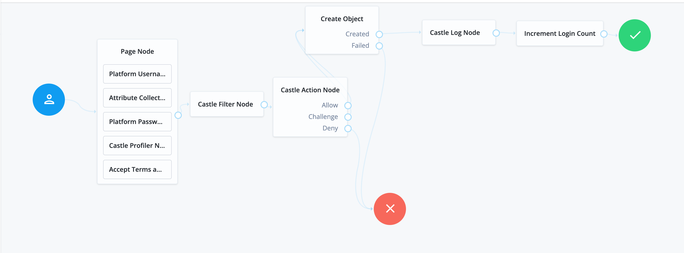

<!--
 * The contents of this file are subject to the terms of the Common Development and
 * Distribution License (the License). You may not use this file except in compliance with the
 * License.
 *
 * You can obtain a copy of the License at legal/CDDLv1.0.txt. See the License for the
 * specific language governing permission and limitations under the License.
 *
 * When distributing Covered Software, include this CDDL Header Notice in each file and include
 * the License file at legal/CDDLv1.0.txt. If applicable, add the following below the CDDL
 * Header, with the fields enclosed by brackets [] replaced by your own identifying
 * information: "Portions copyright [year] [name of copyright owner]".
 *
 * Copyright 2019 ForgeRock AS.
-->
# Castle Authentication Nodes

Castle helps security teams more quickly discover, investigate and stop malicious activity. 

This plugin gives you the ability to use Castle's Risk, Filter and Log APIs which provide risk signals 
and give you the visibility needed to investigate security and fraud incidents. 

See [castle.io](https://castle.io) for more information.

## Usage

To deploy these nodes, download the jar from the releases tab on github
[here](https://github.com/ForgeRock/Castle-Auth-Tree-Nodes/releases/latest). Next, copy the jar into the
../web-container/webapps/openam/WEB-INF/lib directory where AM is deployed. Restart the web container to pick up the
new nodes. The nodes will then appear in the authentication trees components palette.

### Castle Service
This plugin provides a realm-specific Castle Service, where you specify common configuration for Castle nodes.

* **API Secret** - A secret that will be used for authentication purposes.
* **App ID** - Castle App ID.
* **Profiler URI** - Castle Javascript link. We highly suggest you host it yourself.
* **Allowlisted Headers** - A comma-separated list of strings representing HTTP headers that will get passed to the 
  context object with each call to the Castle API, unless they are denylisted. If not set or empty all headers will 
  be sent.
* **Denylisted Headers** - A comma-separated list of strings representing HTTP headers that will never get passed to 
  the context object.
* **Timeout** - An integer that represents the time in milliseconds after which a request fails.
* **Base URL** - The base endpoint of the Castle API without any relative path.

### Castle Profiler Node

This node tags the AM login page with the Castle JS to collect information about the device being used.

### Castle Risk Node

This node makes a request the [Castle Risk API](https://castle.io/risk-api/) to assess user risk.

#### Castle Risk Node Configuration

* **Event** - The Castle Event type.
* **Status** - The Castle Event status.
* **Mail Attribute** - The ForgeRock email attribute.

### Castle Filter Node

This node makes a request the Castle's bot detection [Filter API](https://castle.io/filter-api/) to retrieve a policy decision about an action.

#### Castle Filter Node Configuration

* **Event** - The Castle Event type.
* **Status** - The Castle Event status.
* **Mail Attribute** - The ForgeRock email attribute.

### Castle Log Node

This node makes a request the Castle's Log API. This is an async API that provides visibility into the actions your users take.

#### Castle Log Node Configuration

* **Event** - The Castle Event type.
* **Status** - The Castle Event status.
* **Mail Attribute** - The ForgeRock email attribute.

### Castle Action Node

This node analyzes the response from the Castle Risk Node and routes to the <code>Allow</code>,
<code>Challenge</code> or <code>Deny</code> node outcomes.

### Castle Score Node
This node analyzes the response from the Castle Risk Node and checks to see if the risk score is
above the configured value.

#### Castle Score Node Configuration

* **Score Threshold** - Castle’s APIs return a numerical risk score between zero and one. Low-risk events are scored 
  at or near zero, and high-risk events are scored at or near one.

### Castle Signal Node
This node analyzes the response from the Castle Risk Node and checks to see if an individual signal
has been returned. These signal correspond to Castle Signals found [here](https://docs.castle.io/v1/reference/signals/).

#### Castle Signal Node Configuration
* **Signal Outcomes** - A list of Signals that you would like to check for from a Castle Risk
  evaluation. When a Signal is added to this list, a new outcome will presented on the node. The node will
  iterate through the configured Signals until a Reason code is found and will return that outcome. Otherwise
  the <code>None Triggered</code> outcome will be returned.

### Castle Approve Device Node
This node calls the Castle Approve Device API to update the users device with approval. 
session.

#### Castle Approve Device Node Configuration

* **API Secret** - A secret that will be used for authentication purposes.
* **Base URL** - The base endpoint of the Castle API without any relative path.

### Example Flows

#### Login flows

#### Registration flows

#### Password reset flows

#### Password update flows

